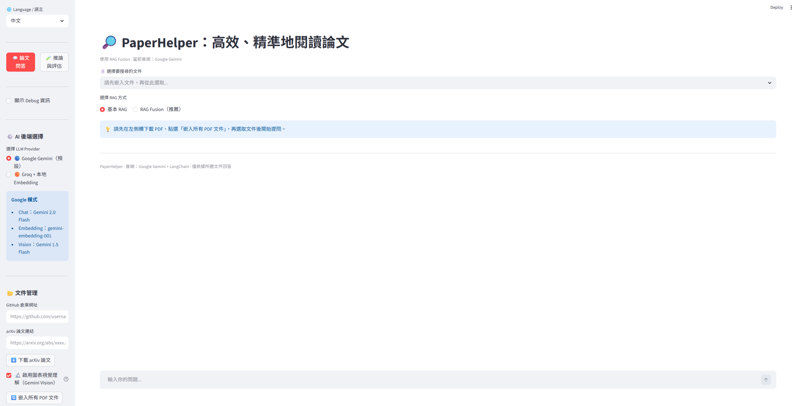
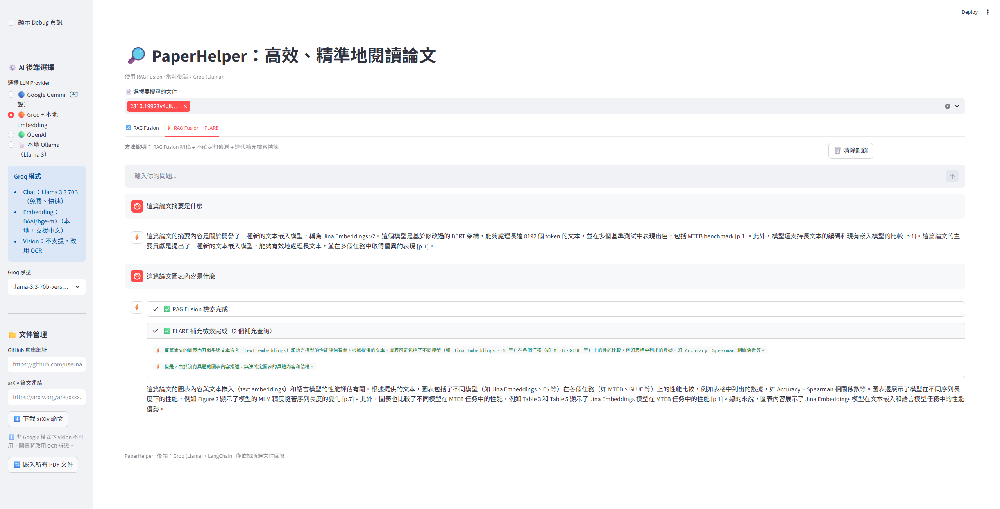
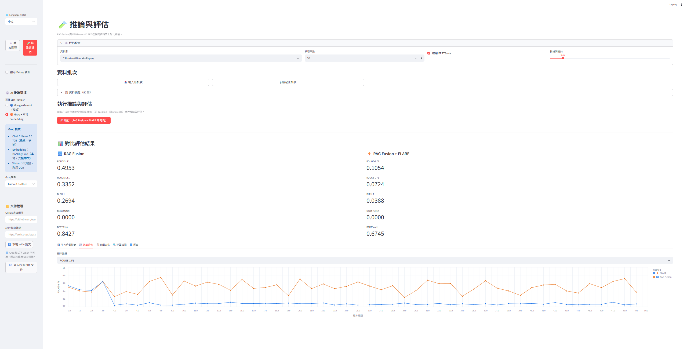

# 生成式 AI 期末專案：智慧論文助手

一個基於 RAG（Retrieval-Augmented Generation）的論文閱讀助手，能針對學術論文進行問答、語意檢索，並提供可追溯的參考依據。

---

## 與原版 PaperHelper 的差異

本專案以 [JerryYin777/PaperHelper](https://github.com/JerryYin777/PaperHelper) 為基礎進行延伸開發。原版的核心設計是：以 GPT-4-1106-Preview API 在 52,000 筆 MLArxivPapers + ArxivQA 資料集上做 RAFT 微調，並透過並行生成對參考文獻進行相關性排序。

本專案在不依賴 fine-tuned 模型的前提下，自行設計了以下功能：

### 1. 版面感知 PDF 解析（`embed_pdf.py`）

原版直接切割 PDF 純文字。本專案實作了完整的五階段解析引擎：

- **單/雙欄自動偵測**：以字元 x0 座標分佈判斷排版，雙欄依序擷取左欄→右欄，避免跨欄合併
- **圖文強綁定**：以正則精準匹配行首 Caption（`Figure X:` / `Table X:`），向上搜尋最近圖片物件，擷取所在頁局部圖像交由 Gemini Vision 描述，每個視覺元素生成結構化 Chunk（`[ELEMENT_TYPE][ID][CAPTION][DESCRIPTION]`）
- **表格轉 Markdown**：pdfplumber `extract_tables()` → 標準 `| --- |` 格式，提升 LLM 理解率
- **語意優先切塊**：偵測章節標題做切割邊界；Abstract / Conclusion 使用較大 chunk（1200 tokens），一般正文 800 tokens
- **批次嵌入 + 429 重試**：Google Embedding 分批呼叫並實作指數退避，避免免費額度速率限制

### 2. 四 Provider 切換（Google Gemini / Groq / OpenAI / Ollama）

原版綁定 OpenAI。本專案透過 `get_llm()` / `get_embedding_func()` 統一介面，支援：

| Provider | Chat 模型 | Embedding 模型 |
|---|---|---|
| Google | Gemini 2.0 Flash | gemini-embedding-001 |
| Groq | Llama 3.3 70B（免費，可切換） | BAAI/bge-m3（本地，支援中文） |
| OpenAI | GPT-4o mini（可切換） | text-embedding-3-small |
| Ollama | Llama 3（本地，可切換） | nomic-embed-text（本地） |

Sidebar 可即時切換，不需重啟。Groq / OpenAI / Ollama 模式下 Vision 不可用，自動改以 OCR 辨識圖表。Ollama 模式無需 API Key，適合完全離線使用。

**Groq 可選模型**：`llama-3.3-70b-versatile`、`llama-3.1-8b-instant`、`mixtral-8x7b-32768`、`gemma2-9b-it`

**OpenAI 可選模型**：`gpt-4o-mini`、`gpt-4o`、`gpt-4-turbo`、`gpt-3.5-turbo`

**Ollama 可選模型**：`llama3`、`llama3.1`、`llama3.2`、`llama3:70b`（需先本地啟動）

### 3. RAG Fusion + FLARE 雙模式問答（`llm_helper.py`、`app.py`）

原版僅有 RAG Fusion。本專案新增 RAG Fusion + FLARE，兩種方法以獨立頁籤分開展示，對話記錄互不干擾：

**RAG Fusion（🔀）**
- 生成 4 個子查詢 → 各自檢索 → Reciprocal Rank Fusion 合併排序
- 支援 streaming 逐字輸出

**RAG Fusion + FLARE（⚡）**
- 在 RAG Fusion 初稿基礎上，要求 LLM 對不確定的論述標記 `[UNCERTAIN]`
- 偵測到標記後以不確定句為查詢，再次做 RRF 補充檢索（最多 2 輪迭代）
- 精煉 prompt 去除標記後輸出最終答案
- 獨立狀態框追蹤兩個階段（RAG Fusion 檢索 / FLARE 補充檢索）的進度

各頁籤均有獨立清除按鈕（🗑️），可分別清除對話記錄。

#### 系統介面預覽

* **RAG Fusion 模式問答：**
    

* **RAG Fusion + FLARE 雙階段檢索問答：**
    

### 4. HuggingFace 資料集推論與評估頁面（`eval_page.py`）

原版沒有評估功能。本專案新增一個獨立評估介面，直接從 HuggingFace 串流載入論文資料集：

- **支援資料集**：
  - `CShorten/ML-ArXiv-Papers`：ML 論文，合成問答題目
  - `arxiv-community/arxiv_dataset`：arXiv 論文，合成問答題目
  - `tau/scrolls`（含 7 個子資料集，如 `qasper`、`narrative_qa`、`quality` 等）
  - `L4NLP/LEval`（含 20 個子資料集，如 `scientific_qa`、`paper_assistant`、`coursera` 等）
- **批次鎖定**：載入後可「🔒 鎖定此批次」，之後重複推論都使用同一組樣本，確保對比公平
- **雙方法同步評估**：一次執行同時對 RAG Fusion 和 RAG Fusion+FLARE 推論，各自的 prediction 寫入同一筆 `EvalSample`，避免資料集不同造成的比較偏差
- **FLARE 信心度門檻**：以詞彙覆蓋率（vocab confidence）客觀評分，可調整觸發 refine 的門檻（0.0–1.0），不依賴 LLM 自評，避免過度自信問題
- **可調推論間隔**：支援三種間隔單位（固定秒數 / ms per token / 秒 per 句），適應不同 API 速率限制
- **delta 追蹤**：每次執行前自動保留前次 agg，下次跑完後 metric 卡片顯示與前次的差值（↕️）
- **評估指標**：ROUGE-L F1、BERTScore F1（distilbert-base-uncased，可開關）、Faithfulness（詞彙覆蓋率）、Compression Ratio
- **視覺化**：並排長條圖、逐筆折線（可選指標）、雙欄分數表格（含 YlGn gradient）、逐筆三欄對照（reference / fusion / flare）
- **匯出**：JSON（含完整 prediction + scores）、CSV（分數彙整）

#### 推論與評估介面預覽



### 5. 雙語介面與 Debug 模式

- Sidebar 可即時切換中文 / English 介面，不需重啟
- Debug 模式（Sidebar checkbox）可在 Sidebar 顯示即時 log，方便開發除錯

---

## 專案結構

```text
PaperHelper/
│
├── app.py          # Streamlit 主程式（頁面路由、Provider 切換、雙頁籤問答）
├── embed_pdf.py    # 版面感知 PDF 解析與 FAISS 嵌入引擎
├── llm_helper.py   # RAG Fusion / RAG Fusion+FLARE 鏈，LLM & Embedding 工廠函式
├── agent_helper.py # Streamlit callback 整合與 tenacity 重試裝飾器
├── eval_page.py    # HuggingFace 資料集推論與評估介面
├── requirements.txt
├── README.md
│
├── pdf/            # 放置要嵌入的 PDF 論文
├── index/          # FAISS 索引輸出目錄（自動生成）
│
└── .streamlit/
    └── secrets.toml
```

---

## 安裝方式

### 1. Clone 專案

```bash
git clone https://github.com/hankchou2004/generative-ai-final-project-paper-assistant.git
cd generative-ai-final-project-paper-assistant
```

### 2. 安裝套件

```bash
pip install -r requirements.txt
```

### 3. 設定 API Key

建立 `.streamlit/secrets.toml`：

```toml
GOOGLE_API_KEY = "your_google_api_key"
GROQ_API_KEY   = "your_groq_api_key"    # 選填，免費申請於 console.groq.com
OPENAI_API_KEY = "your_openai_api_key"  # 選填，申請於 platform.openai.com
```

> Ollama 模式無需 API Key，但需先本地執行 `ollama run llama3` 與 `ollama pull nomic-embed-text`。

### 4. 啟動

```bash
streamlit run app.py
```

---

## 使用流程

### 論文問答

1. Sidebar 選擇語言（中文 / English）
2. Sidebar 選擇 AI 後端（Google Gemini / Groq / OpenAI / Ollama）
3. 輸入 arXiv 連結或 GitHub Repo 網址，下載 PDF
4. 點選「🔄 嵌入所有 PDF 文件」
5. 主頁面選取要搜尋的文件
6. 切換頁籤選擇 RAG Fusion 或 RAG Fusion+FLARE，開始提問

### 推論與評估

1. 切換至「🧪 推論與評估」頁面
2. 選擇資料集與子資料集、抽取筆數、間隔設定與 FLARE 信心門檻
3. 點選「📥 載入新批次」
4. 若需與下次比較，點選「🔒 鎖定此批次」
5. 點選「🚀 執行（兩方法同時跑）」
6. 查看對比圖表，或匯出 JSON / CSV

---

## 技術清單

- Python / Streamlit
- LangChain（`langchain-core`、`langchain-community`、`langchain-google-genai`、`langchain-groq`、`langchain-openai`、`langchain-ollama`）
- FAISS（向量索引）
- pdfplumber、pypdfium2（PDF 解析）
- pytesseract（OCR，非 Google 模式圖表辨識）
- HuggingFace `datasets`（串流載入評估資料集）
- rouge-score、bert-score（評估指標）
- Altair（評估結果視覺化）
- tenacity（API 重試）

---

## 注意事項

- Groq 免費層每日有 token 配額（約 100,000 tokens/日）；FLARE 每筆需兩次以上 LLM 呼叫，建議評估時使用 Google Gemini 或調高推論間隔
- 首次嵌入 PDF 時，Google Embedding 會分批呼叫並自動等待速率限制
- BERTScore 首次執行需下載 `distilbert-base-uncased`（約 250 MB）
- Ollama 模式需先在本地執行 `ollama run llama3`（chat）與 `ollama pull nomic-embed-text`（embedding）
- 評估資料集建議使用具備真實問答對的 subset（如 SCROLLS/qasper、L-Eval/scientific_qa），以充分體現 RAG 的檢索優勢；純摘要生成任務（如 L-Eval/paper_assistant）不適合評估 RAG 問答性能

---

## Reference

- Original PaperHelper：https://github.com/JerryYin777/PaperHelper
- FLARE：[Active Retrieval Augmented Generation](https://arxiv.org/abs/2305.06983)
- RAG Fusion：[Forget RAG, the Future is RAG-Fusion](https://arxiv.org/abs/2402.03367)